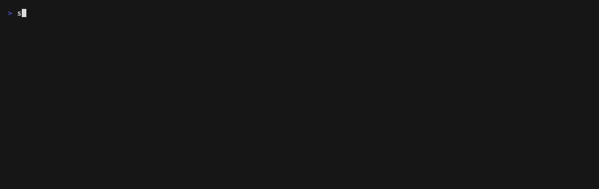
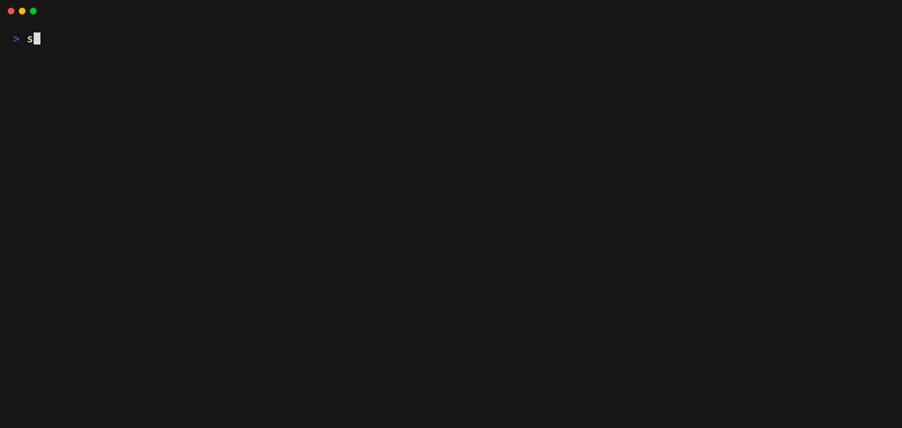
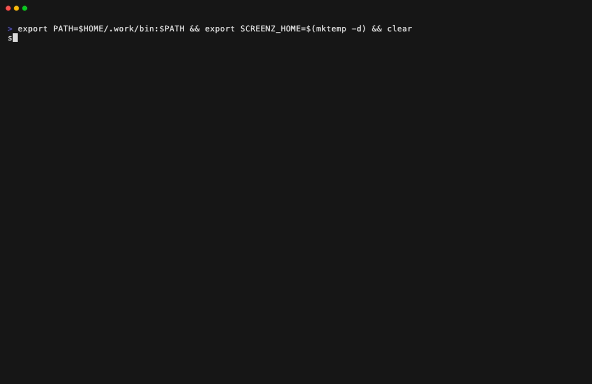

<!-- SPIKE: candidate root README.md if VHS is chosen for animated docs.
     GIF paths are siblings here; promotion to root would move them to docs/demos/. -->

# screenz

Profile-driven bulk window layout CLI for macOS.
One command moves whole groups of application windows (by bundle id) onto named display regions, reads every frame back, and exits 0 only when everything landed where it was asked.
Rules compose from flags and save as commented YAML profiles per context (office, home, client).



The demo is the office context switch: VS Code maximises onto the built-in display, Chrome docks to an external's left half.
Every `apply` is verified.
The plan is previewable with `--dry-run`, each moved window's frame is read back, and `TARGET` must equal `ACTUAL` within tolerance for exit 0.

## See your world first

`screenz doctor` names the app that must hold the Accessibility grant and checks every binding.
`screenz status` shows windows grouped by application and every connected display, filterable with the same `--match` grammar rules use.



## Save the context, replay it forever

A rule that works once becomes a named profile.
Profiles are commented YAML, and your hand-written comments survive every save.



## Quickstart

Install the latest release into `~/.work/bin` (no App Store, no Homebrew; `gh` downloads never set the quarantine xattr):

```sh
mkdir -p ~/.work/bin
gh release download --repo neozenith/screenz \
  --pattern '*darwin_arm64.tar.gz' --output - | tar -xz -C ~/.work/bin
```

Intel Macs: use `--pattern '*darwin_amd64.tar.gz'`.
Pin a version by adding its tag: `gh release download v0.1.0 …`.
After that first install, `screenz update` self-updates in place (checksum-verified atomic swap; `--check` to just look).

Then grant Accessibility to **your terminal app** (not the binary; TCC attributes a shell-launched tool to the app hosting the shell) and verify:

```sh
screenz doctor                 # names the app to grant; exits 0 when trusted
screenz status                 # windows by app + displays
screenz profile init office    # commented template in ~/.config/screenz/profiles/
screenz apply --dry-run office # preview the context switch
screenz apply office           # do it, verified
```

Full install and grant runbook (browser downloads, macOS 26.1 caveats, `tccutil` reset): [docs/install.md](../../install.md).

## How these demos are made

The demos are **code**: each GIF is rendered from a checked-in [VHS](https://github.com/charmbracelet/vhs) tape (`*.tape`), so they regenerate deterministically whenever the CLI changes.

```sh
brew install vhs
cd docs/spikes/vhs && vhs demo-apply.tape   # re-render one demo
```

VHS drives a real shell in demo mode (ADR-0018): `SCREENZ_DEMO=../demo-world.json` replays a recorded three-display world through the real pipeline with placement simulated.
Every line except the ACTUAL column is genuinely computed, `screenz doctor` discloses the mode, and no monitors are needed to regenerate.
The fake title bar is VHS's own: `Set WindowBar Colorful` draws the window chrome at render time, no compositing needed.
`charmbracelet/vhs-action` can re-render them in CI on every release so the README can never drift from the binary.

## Development

See [CONTRIBUTING.md](../../../CONTRIBUTING.md) for build, test tiers and house rules, [adrs/](../../../adrs/README.md) for design decisions, and [GLOSSARY.md](../../../GLOSSARY.md) for the project vocabulary.

## License

[MIT](../../../LICENSE)
